<!-- inbuilt animation: self-drawing lemniscate with an orbiting dot -->
 

<table>
<tr>
<td width="58%" valign="top">

### ∞ Hey, I'm Pushyanth

A **CS student** and developer who loves turning ideas into **shipped, polished software**.

- 🔭 Exploring web development, AI/ML and cloud
- 🧠 Sharpening logic with daily DSA in C++
- 🤖 Building with AI — but understanding, testing and owning every outcome
- 🌱 Open-source enthusiast · local-first believer

> *"Understand it, test it, own it — then ship it."*

</td>
<td width="42%" valign="top">

`~ always building something new ~`

</td>
</tr>
</table>

### ⚡ Daily Drivers

---

## 📊 GitHub

  

`∞` **Code · Create · Learn · Repeat** `∞`

 

<a href="https://pushyanth02.github.io/Portfolio/"><b>Everything ships with care</b></a>

